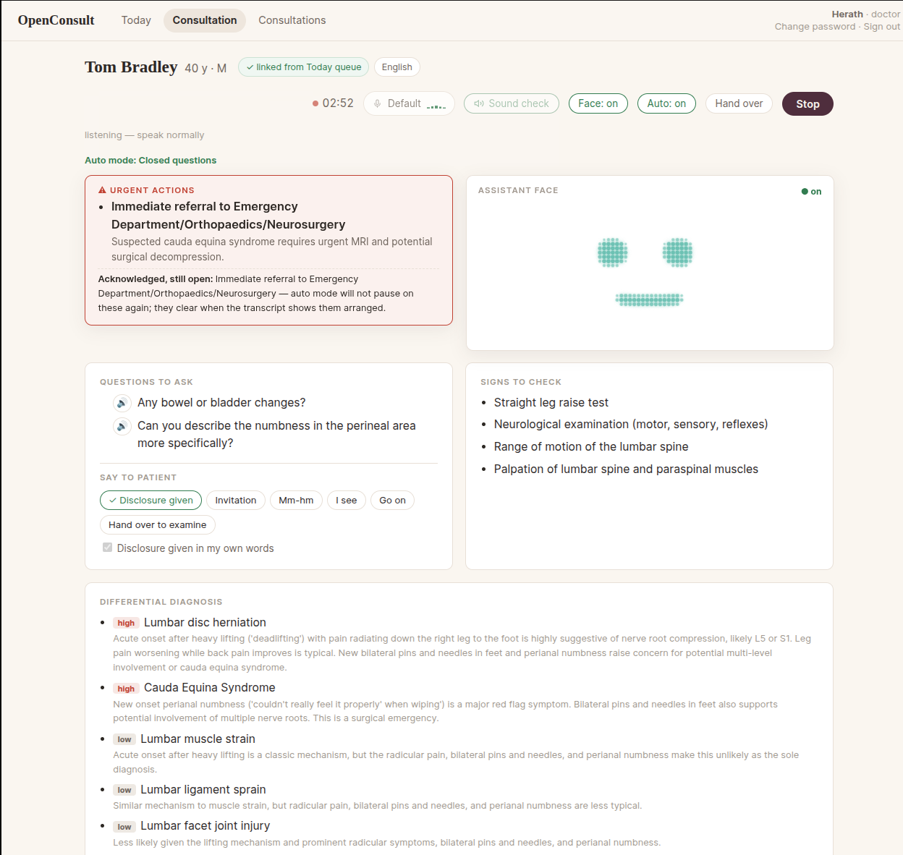
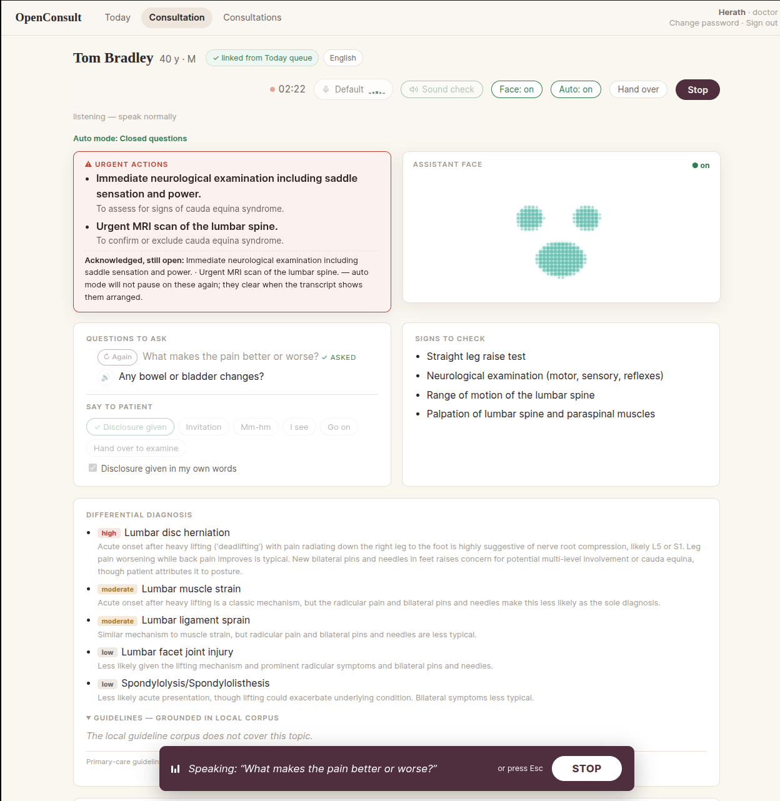

# OpenConsult

[](https://doi.org/10.5281/zenodo.22689260)

**A research/educational prototype for AI-assisted medical consultations — fully local, human-in-the-loop, English-only in v1.**

Transcribes a doctor–patient consultation live, offers real-time clinical decision support (differentials, questions to ask, signs to elicit), then produces a diarised transcript, a concise doctor-style note with every claim cited to the transcript, referral letters, and evidence-grounded guideline summaries — all running locally on consumer hardware.

> ⚠️ **Status & intent:** This is an experimental prototype for research, education, and demonstration purposes only. It is **not** a medical device, has not undergone any regulatory assessment, and must never be used with real patients or real patient data. All development and demos use synthetic (scripted/acted) consultations.

---

**A full consultation, start to finish (5 min 43 s).** An acted patient; the doctor supervises throughout. Live transcript and clinical decision support first, then the note with every claim cited to the transcript, and the referral letter.

https://github.com/user-attachments/assets/84bf3635-54de-479d-8caa-2ebf5787e5e9

## What I'd like feedback on

I am a practising GP and I built this mostly in my own time. I would rather
hear what is wrong with it than what is good about it. Three things in
particular.

**Where it breaks in a real clinic.** Everything here has been tested in a
quiet room with a scripted or acted patient. That is not a clinic. Background
noise, a third person in the room, a patient who talks across the doctor, a
cheap microphone, a machine without a 24 GB card — tell me what you think
falls over first.

**The code, which is mostly AI-written.** I wrote the specifications and
reviewed the work, an AI assistant wrote most of the code, and I refereed. I
have not hidden that, and I have not tidied away what it cost: five runs in a
real room turned up four serious defects that the test suite had passed.
Each one is written up with the reason no test caught it. If you think the
review was not careful enough, the whole history is here to check.

**Security.** An audit found twelve issues, one of them critical. What they
were and what was done about them is in [help/08-security.md](help/08-security.md).
I would like to know what that audit missed.

Open a [Discussion](../../discussions) or an issue. Blunt is welcome.

## 1. Why this project

- **Low-resource language clinical NLP — closed with a published negative result.** This project began with Sri Lanka's real workflow in mind: consultations in Sinhala, heavily code-switched with English medical terms, documented in English. A pre-registered evaluation then showed that no available model transcribes code-switched clinical Sinhala safely — drug names and key numbers did not survive in any candidate — so v1 is English-only by explicit decision, and the evaluation records in `evals/` are kept as a standalone research contribution. Sinhala is out of scope, not postponed.
- **Local-first, privacy-first.** Everything — speech recognition, translation, clinical reasoning — runs on a single local machine. No consultation audio or text leaves the premises. This mirrors real-world data-protection constraints in healthcare.
- **Human-in-the-loop by design.** Every AI output is a *draft*. Nothing enters the record until the doctor reviews, edits, and approves it.

## 2. What it does (user's-eye view)

**During the consultation (live):**
1. The doctor starts a session in the browser; the microphone streams audio to the server.
2. A rough live transcript appears as the conversation happens.
3. A side panel updates periodically with: a working differential diagnosis, suggested questions to ask, and clinical signs to look for — helping narrow the differential in real time.



**After the consultation (a background job, takes a minute or two):**

4. The full recording is re-transcribed at higher quality and **diarised** (labelled *Doctor:* / *Patient:*), with quality gates that refuse to draft from an untrustworthy transcript.
5. A concise SOAP-style note is drafted — every claim citing the transcript turns it came from — plus a guideline summary grounded in retrieved guideline text (not the model's memory).
6. The doctor reviews, edits, and signs off the note. Only then is it final — and only from a signed note can referral letters be drafted.


**Around the edges:**
- User accounts with roles (doctor, receptionist, admin) — enforced server-side; the receptionist manages the queue and can never open clinical content.
- A patient database holding consultations, transcripts (both languages), notes, and an audit trail of who did what and what the AI suggested when.

The note and letter screens above are from 31 July 2026 and carry the project's earlier name; the [help series](help/02-using-it-step-by-step.md) walks through the same consultation step by step.

> **New to the project?** Start with the [help series](help/00-introduction.md) — a short, diagram-led tour of what the app does, how it's built, and why it works the way it does (including what an independent security audit found). It's written for reading, not installing.

See PROJECT_PLAN.md for the full plan.

## Auto mode (experimental, off by default)

Auto mode lets the assistant conduct the history-taking itself while the
doctor supervises. After the fixed disclosure that it is a computer, it
invites the patient to tell their story, encourages them through silences,
and then asks the panel's questions aloud one at a time, choosing from a
standing queue that every assessment pass feeds and re-orders. The doctor
can take it back with one tap at any moment; an urgency alarm pauses the
questioning until the doctor acknowledges it; and the machine's own voice
is excluded from the transcript. It is experimental: it has been run only
in scripted or acted consultations, and it is **off by default** behind
`AUTO_MODE_ENABLED` (see `.env.example`). The question wording and the
cadence — how long it waits before deciding the patient has finished, how
it phrases the panel's questions, what it says while it thinks — are being
refined for v1.1 from the pilot runs. The design is in
`AGENDA_QUEUE_SPEC.md` (the queue, the re-ranker, the number to beat) and
`PHASE_7C_SPEC.md`; the pilot diagnostics that drive the refinements are
kept outside the repository, on the reference machine, in
`~/Documents/Consultation-ai/Solo Pilot Documents/`.



## Getting started (Phase 0)

Requirements: Linux, [uv](https://docs.astral.sh/uv/) (installs its own
Python 3.12), PostgreSQL 18 with pgvector, an NVIDIA GPU with 24 GB of
VRAM for the full pipeline (the reference machine is one RTX 4090), and
`ffmpeg` on the PATH. The steps below were followed literally on a fresh
clone on 10 September 2026; every one is copy-paste.

```bash
# 1. Install uv (one-time)
curl -LsSf https://astral.sh/uv/install.sh | sh

# 2. Install PostgreSQL + pgvector (one-time), then create the role, the
#    database and the extension. Choose a real password; it goes into
#    .env in step 4. CREATEDB and the extension in template1 are what the
#    test suite needs to build and drop its own disposable database
#    (consultation_ai_test) — it never touches this one.
sudo apt update && sudo apt install -y postgresql postgresql-18-pgvector ffmpeg
sudo -u postgres psql <<'SQL'
CREATE ROLE consultation_app LOGIN PASSWORD 'choose-a-real-password' CREATEDB;
CREATE DATABASE consultation_ai OWNER consultation_app;
\c consultation_ai
CREATE EXTENSION IF NOT EXISTS vector;
\c template1
CREATE EXTENSION IF NOT EXISTS vector;
SQL

# 3. Install project dependencies. On a fresh machine this downloads the
#    CUDA and PyTorch wheels — several GB, once.
uv sync

# 4. Configure: copy the template, then edit .env — put the step-2
#    password into DATABASE_URL, and set SECRET_KEY to a real value
#    (`openssl rand -hex 32`): the app refuses to start on a missing,
#    short, or placeholder key. .env.example documents every setting the
#    app reads, each with its default; nothing else is required.
cp .env.example .env

# 5. Create the first admin from the server shell (password prompted) —
#    public registration can never create an admin
uv run python scripts/manage_users.py create your-username admin "Your Name"

# 6. Run the app — the production invocation, exactly what the systemd
#    unit on the reference machine runs
uv run uvicorn app.main:app --host 0.0.0.0 --port 8000
```

(`--reload` is development-only: it auto-restarts on code edits and must
never be used for an internet-exposed app.)

**What downloads when.** Nothing in the repository is a model. The live
transcriber fetches `distil-large-v3` (~1.5 GB) on the first Start. The
first **Stop** fetches WhisperX `large-v3` (~3 GB), its English alignment
model and the silero VAD, and the pyannote diarisation weights (gated —
see the one-time setup below; the first Stop fails without it). MedGemma
(~17 GB) and embeddinggemma (~600 MB) are pulled through Ollama by the
commands further down, under the terms in § Model terms. Expect the
first Stop to take several minutes longer than the second.

Then open http://127.0.0.1:8000/login and register two accounts — one
receptionist, one doctor. Registrations start pending: approve both from
the admin account you created in step 5 (*Users* view). The two-role demo
flow, per the plan:

1. **Receptionist** → *Today* tab: add a synthetic patient to the walk-in
   queue (reorder with ↑/↓ while waiting).
2. **Doctor** → *Today* tab: click **Start consultation** on a waiting
   patient → the live consultation page opens, tied to that patient.
3. Consult (speak), press **Stop** → the queue entry completes, the note
   pipeline runs, and the review page opens.
4. Review, acknowledge any urgency banner, **Approve** → the consultation
   is archived read-only in the *Consultations* tab.

Role boundaries are enforced server-side: the receptionist manages the
queue but gets 403s on transcripts, notes, and review pages. Admins get
an *Audit* tab (who viewed/edited/approved/acknowledged what, when).

Interactive API docs live at http://127.0.0.1:8000/docs.

**Live transcription (Phase 1):** open http://127.0.0.1:8000/live, click
Start, allow microphone access, and speak. Confirmed text appears with
timestamps; the grey italic line is the model's provisional guess. Runs
`distil-large-v3` on the GPU (override with `WHISPER_MODEL`, e.g.
`WHISPER_MODEL=small.en` for CPU-only machines). The first run downloads
the model (~1.5 GB).

**Live clinical decision support (Phase 3):** the live page shows a CDS
panel — differential diagnoses, questions to ask, signs to check — updated
as the conversation grows. It needs MedGemma running locally via
[Ollama](https://ollama.com):

```bash
ollama serve &
ollama pull hf.co/unsloth/medgemma-27b-text-it-GGUF:Q4_K_M   # ~17 GB, needs ~20 GB GPU
```

Without Ollama running, transcription still works; the CDS panel reports
itself unavailable. Replay a mock consultation through the CDS engine
without speaking:

```bash
uv run python scripts/simulate_cds.py mock_consultations/01_chest_pain_en.md
```

The mock consultations ship as scripts and frozen reference transcripts;
the real two-voice WAV recordings of them are deliberately not
distributed — consent covered recording, not publication — so others
record their own from the scripts.

**Guideline grounding (Phase 4):** the live page shows a guidelines panel —
a summary grounded ONLY in retrieved guideline passages, each claim cited,
with a provenance line (corpus name, version, ingestion date). If the local
corpus doesn't cover the topic, the panel declines rather than improvises.
The corpus is defined per installation: the repository ships a
validated example manifest, and each operator lists the guideline
sources they hold licences to use this way. Copy it, edit it, then
build:

```bash
cp corpus/manifest.example.yaml corpus/manifest.yaml
ollama pull embeddinggemma
uv run python scripts/ingest_guidelines.py
```

Without a manifest the app still runs; the guidelines panel reports
that no corpus is configured and declines every query.

**Speaker diarisation (one-time setup):** the finalisation pipeline uses
`pyannote/speaker-diarization-3.1`, which is licence-gated on Hugging
Face. Create a free account, accept the model's terms on its model page,
and authenticate with `hf auth login` — do this before your first Stop,
not after.

**The voice (Phase 7a):** the app speaks through Piper, installed
deliberately outside the app's environment (see NOTICE for why):

```bash
uv tool install piper-tts
# download voice en_GB-alba-medium (.onnx + .json) to ~/.local/share/piper-voices/
```

Point `TTS_COMMAND` and `TTS_MODEL_PATH` at it in `.env` (absolute
paths — see `.env.example`). The sound-check button beside Start
confirms the room can hear it.

**Post-consultation note (Phase 2):** pressing Stop triggers the
finalisation pipeline — WhisperX re-transcription, pyannote speaker
diarisation, Doctor/Patient role attribution — and lands you on a review
page with a draft SOAP note. Every claim cites its transcript turns
(click to verify); numbers/drugs/laterality resting on low-confidence
audio are marked ⚠. Edit in place, Regenerate after transcript
corrections, Approve to sign off, or copy as EMR-ready plain text.
The heavy models take turns on the GPU (MedGemma is unloaded while
WhisperX/pyannote run), so finalisation takes a minute or two.

Evaluations for the CDS urgency alarm, RAG grounding, and note quality
live in `evals/`, with reusable harnesses in `scripts/evaluate_*.py`.

Run the tests with:

```bash
uv run pytest
```

For running everything as system services that survive a reboot
(PostgreSQL, Ollama, the app), and for the after-reboot checklist and
known failure modes, see `HANDOVER.md` — the engineering record. The
reader-facing tour lives in `help/`.

## Run it with Docker

`docker-compose.yml` packages the app and its database; see
`DOCKER_DEMO_SPEC.md` for the design. Prerequisites, honestly stated:

- **NVIDIA Container Toolkit** (its own setup on WSL2) and a GPU with
  **24 GB VRAM, effectively exclusive** — the finalisation pipeline's
  model-swap choreography assumes sole ownership of the card; a second
  GPU workload means OOM, not slowness.
- **A Hugging Face token**, and the **manual licence acceptance for
  `pyannote/speaker-diarization-3.1`** on huggingface.co before your
  first Stop — that step cannot be automated.
- **Ollama**: a host install is the default path (`OLLAMA_URL` points
  at it); a bundled service exists behind `--profile ollama`.

```bash
cp .env.example .env          # then set SECRET_KEY: openssl rand -hex 32
docker compose up -d --build
docker compose run --rm app cp corpus/manifest.example.yaml corpus/manifest.yaml  # then edit it in the corpus volume
docker compose run --rm app python scripts/ingest_guidelines.py  # first run, validated, re-runnable
docker compose exec app python scripts/manage_users.py create <user> admin "Your Name"
```

Then open http://localhost:8000/login — **localhost is the secure
origin the microphone needs** in a single-machine demo; any other
address requires TLS. The suite runs in-container on a fresh clone:
`docker compose run --rm app pytest`.

## Model terms

This repository redistributes no model weights. Every model is fetched
by the operator, under that model's own terms, using the commands in
this README; the code only ever calls a model that is already present
(the app talks to a local Ollama server and to weights on the local
disk, and never downloads MedGemma or embeddinggemma itself).

- **MedGemma 27B** (`hf.co/unsloth/medgemma-27b-text-it-GGUF:Q4_K_M`,
  the community GGUF of Google's `medgemma-27b-text-it`) is distributed
  under Google's [Health AI Developer Foundations terms of use](https://developers.google.com/health-ai-developer-foundations/terms)
  and the [Gemma terms of use](https://ai.google.dev/gemma/terms). You
  must accept them — on the [model's Hugging Face page](https://huggingface.co/google/medgemma-27b-text-it),
  or by the act of pulling through Ollama, which the terms treat as
  acceptance — before use. What the code does: `ollama pull` fetches the
  GGUF onto your machine, and the app then calls it through Ollama's
  local API.
- **embeddinggemma** (`ollama pull embeddinggemma`) is distributed under
  the [Gemma terms of use](https://ai.google.dev/gemma/terms); accept them
  on [Hugging Face](https://huggingface.co/google/embeddinggemma-300m) or
  by pulling through Ollama, as above.
- **Whisper**: `distil-large-v3` ([distil-whisper](https://huggingface.co/distil-whisper/distil-large-v3),
  MIT) for the live path and `large-v3` ([OpenAI Whisper](https://github.com/openai/whisper),
  MIT) for the final pass, run through [faster-whisper](https://github.com/SYSTRAN/faster-whisper)
  (MIT) and [WhisperX](https://github.com/m-bain/whisperX) (BSD-2-Clause);
  downloaded from Hugging Face on first use.
- **pyannote** `speaker-diarization-3.1` ([Hugging Face](https://huggingface.co/pyannote/speaker-diarization-3.1),
  MIT, gated): accept its access agreement on Hugging Face before your
  first Stop, as described above.
- **The voice**: [Piper](https://github.com/OHF-Voice/piper1-gpl)
  (GPL-3.0-or-later) runs as a separate process, never linked, with the
  `en_GB-alba-medium` voice from [rhasspy/piper-voices](https://huggingface.co/rhasspy/piper-voices),
  whose training data is CC BY 4.0 and whose weights state no licence of
  their own — see `NOTICE` for the exact position.

## Licence

This project's own code is licensed **AGPL-3.0-or-later** — see
`LICENSE`. The vendored face engine at `vendor/kindalive/` remains MIT
under its upstream licence (`vendor/kindalive/LICENSE`); `NOTICE`
records the full third-party picture, including model and corpus terms.
The "never real patients" rule at the top of this README is a research-
scope constraint of the prototype, not a licence term.
