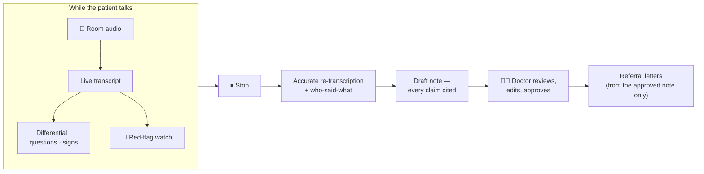

# A consultation assistant that runs entirely in the room

*Part of the Consultation AI help series. True as of 2026-07-31 (HEAD `ef6c583`).*

> **Read this first:** Consultation AI is a research and education platform.
> It is **not a medical device** and it must **never be used with real
> patients**. Every consultation it has ever heard was scripted or acted.

## What happens in the room

A doctor presses **Start**. While the patient talks, the app listens through
the room microphone and writes a live transcript on screen. As the story
unfolds, a clinical reasoning model reads the transcript and quietly keeps
three lists: what this might be, what to ask next, what to examine. If it
spots a red flag — chest pain that sounds cardiac, a history that needs an
ECG *today* — an alarm appears and stays until it is dealt with.

The doctor presses **Stop**. The app re-listens to the whole recording with
better models, works out who said what, and drafts a clinical note. Every
claim in that note cites the exact lines of the transcript it came from —
click a claim, see the words behind it. The doctor reviews, edits, and
approves — or doesn't. Nothing is ever final until a human signs it.

All of this runs on **one ordinary desktop computer**. No cloud, no
subscription, no audio leaving the building. That is not a cost-saving —
it is the point: a consultation is one of the most private conversations
there is, and this project asks how much of a modern AI assistant can live
entirely inside the room.

## What it is — and what it is not

**It is** an open research platform, built by a GP, for studying how
clinicians and AI actually work together: whether doctors check the
machine's claims, how a system should refuse when it isn't sure, what
speech it gets wrong and whether the safety net notices.

**It is not** a product, and not a route to using AI with real patients.
Under the UK's 2026 regulatory position, transcription and note-drafting
for clinician review fall outside the medical-device definition — but
diagnosis support does not, and this app deliberately contains both halves
so that both can be studied. It stays synthetic-only.

## Three ideas you will meet everywhere

**The note is the doctor's document.** The machine drafts; only a human
approves. The system never merges its own warnings into the note text, and
a letter can only be generated from a note a doctor has already signed.

**Safety by construction, not by filter.** Where it matters most, the app
does not *check* for bad outcomes — it makes them impossible to express.
Example: the machine can speak to the patient, yet its voice can never
appear in the transcript, because its words are excluded from the audio
pipeline by server-held bookkeeping, not recognised and deleted afterwards.
A filter can miss; a structure cannot.

**Evaluation first, failures kept.** Every phase shipped with a
pre-registered evaluation, and the failures are documented as carefully as
the successes — including a whole language dropped after the evidence said
no model could transcribe it safely, and five real-room test runs that
each found a defect no automated test had caught.

## Find your way in

| You are… | Start with |
|---|---|
| A clinician curious what it does | [A consultation's journey](01-a-consultations-journey.md) → *The features* (coming soon) |
| Someone who wants to run it | [Installing and running it](03-installing-and-running.md) |
| A developer or researcher | [The architecture](04-the-architecture.md) → [Safety by construction](06-safety-by-construction.md) |
| Wondering about its limits | [Why one consultation at a time](05-why-one-consultation-at-a-time.md) |
| Interested in what went wrong | [What the room taught us](07-what-the-room-taught-us.md) |

---

## Where to go next

New here? The tour reads well in this order:
[A consultation's journey](01-a-consultations-journey.md) →
[The architecture](04-the-architecture.md) →
[Why one consultation at a time](05-why-one-consultation-at-a-time.md) →
[Safety by construction](06-safety-by-construction.md) →
[What the room taught us](07-what-the-room-taught-us.md) →
[Is AI-written code safe?](08-security.md). Ready to run it yourself?
[Installing and running it](03-installing-and-running.md).

*The engineering record lives in [`HANDOVER.md`](../HANDOVER.md); these
pages explain, that document records.*
