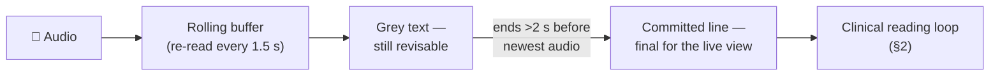
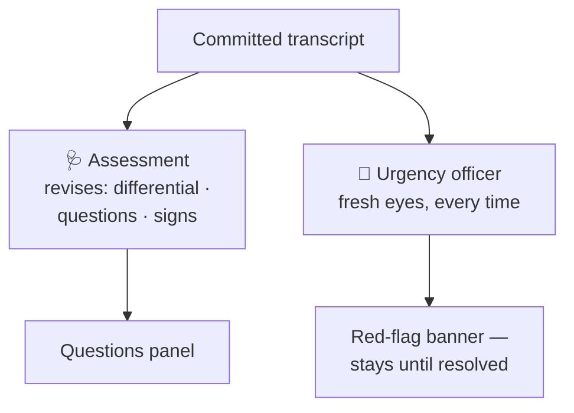
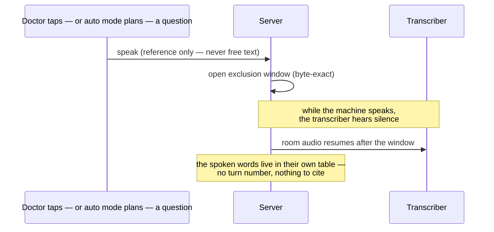
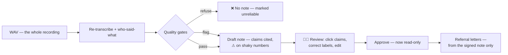

# A consultation's journey — from sound waves to a signed note

*Part of the Consultation AI help series. True as of 2026-07-31 (HEAD `ef6c583`).*

Every other article in this folder hangs off this one. It follows a single
consultation from the first word spoken to the moment a doctor signs the
note — and shows where the safety decisions live along the way.

## 1 · While the patient talks: rough but live

The live transcript is deliberately quick rather than perfect. Every 1.5
seconds the app re-transcribes a short rolling buffer of recent audio. A
sentence only becomes *committed* — black text, final — once it ends well
clear of the newest audio; until then it shows as a grey, revisable guess.

Why settle for rough? Because the accurate pass comes later, over the whole
recording, with better models and time to think. Live speed and final
accuracy are different jobs, so the app uses different tools for each.

## 2 · The two hats: one model, two very different jobs

As committed transcript accumulates, a clinical model reads it and does two
jobs — kept **strictly separate**, because combining them failed every way
it was tried.

The **assessment** is a careful reviser. It keeps a differential diagnosis,
questions worth asking (ordered by clinical priority) and signs worth
examining. Each update *revises* the previous one under rules: condition
names stay put, reasoning must absorb new evidence, answered questions drop
off the list.

The **urgency officer** is deliberately forgetful. It reads the current
transcript fresh every time, with no memory of what it said before — so
yesterday's "no alarm" can never anchor today's. When it fires, a red
banner appears and stays until the transcript shows the action was done or
arranged. The bookkeeping that clears the alarm is code, not the model.

## 3 · When the machine speaks: excluded by construction

The doctor can tap a suggested question and the app asks it aloud — and if
auto mode is enabled, the app can conduct the history-taking itself,
inviting, encouraging and asking questions of its own choosing while the
doctor supervises. Either way it speaks only after telling the patient, in a
fixed disclosure, that it is a computer. This creates the project's sharpest
safety problem: **if the system's own voice reached the transcript, it could
put words in the patient's mouth**, and the note would faithfully cite them.

The defence is structural. The client tells the server *when* playback runs;
the server feeds the transcriber **silence** for exactly those spans and
keeps the machine's words in a separate table that no note can cite. Nothing
recognises the machine's voice — nothing needs to. The recording itself is
never altered.

One tap — or the Escape key — cuts the machine off mid-sentence, always.
The doctor wins every race.

## 4 · Stop: the accurate pass

Stop ends the consultation; the patient can leave. Behind the scenes a
queued pipeline re-transcribes the whole recording with a stronger model,
works out who said what (the doctor *declares* how many voices were in the
room — measurement proved less reliable than asking), and drafts the note.

Before any note is drafted, **quality gates** read the transcript first. A
transcript with badly low confidence or missing speech is *refused* — no
note at all, because a fluent note over a broken transcript is the most
dangerous artifact this system can produce. Lesser concerns flag an amber
banner the doctor must acknowledge before approving.

## 5 · The note: every claim on a leash

Each sentence of the draft cites the transcript lines it came from, checked
in code — a note that cannot ground enough of its claims is refused, not
shown. Numbers, doses and left/right statements that rest on low-confidence
audio carry a ⚠ flag. Clicking any claim opens the exact words behind it.

The reviewing doctor can correct a speaker label or a mis-heard word — and
any such change re-arms the gate: a note drafted against the old labels
cannot be approved until it is regenerated or knowingly acknowledged. A
"show what was heard" toggle reveals the raw, pre-processing transcript,
so even the pipeline's own tidying is inspectable.

## 6 · After approval

An approved note is frozen, its audio compressed losslessly, and only then
can referral letters be drafted — generated from the signed note alone,
never from the raw transcript, with their own citation gate and their own
approval step. The assessment's differential is masked from the letter
entirely: the letter presents evidence; the specialist draws conclusions.

---

## Where to go next

- **See it on screen →** [Using it, step by step](02-using-it-step-by-step.md) — the same journey as screenshots, one per step.
- **Continue the tour →** [The architecture](04-the-architecture.md) — how
  five AI models share one machine to do everything you just followed.
- **Pull a thread →** [Safety by construction](06-safety-by-construction.md)
  — why the machine's own voice can never reach the transcript.
- **Pull a thread →** [Why one consultation at a time](05-why-one-consultation-at-a-time.md)
  — the promise behind that single-room limit.

*The engineering record of every mechanism above is in [`HANDOVER.md`](../HANDOVER.md).*
