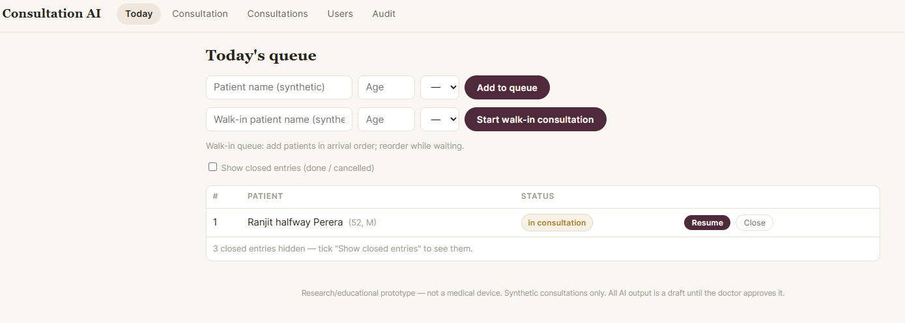
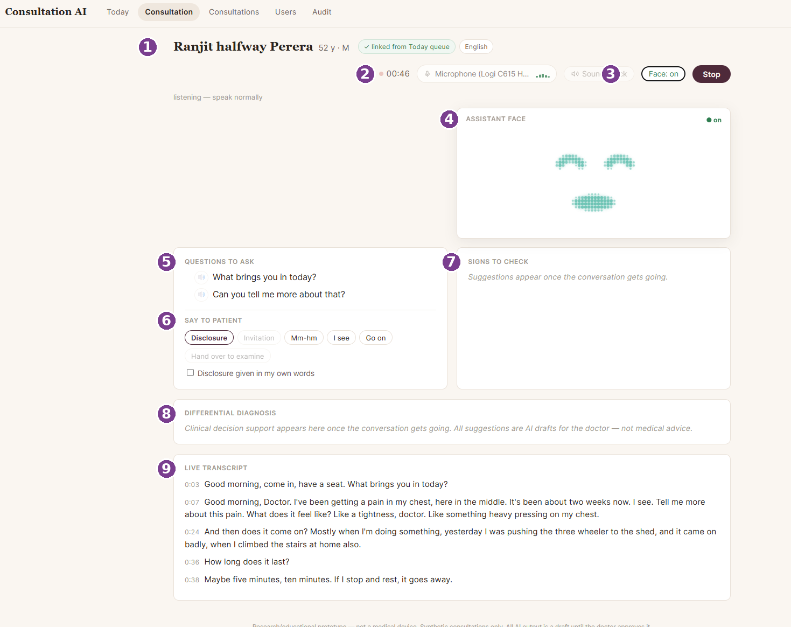
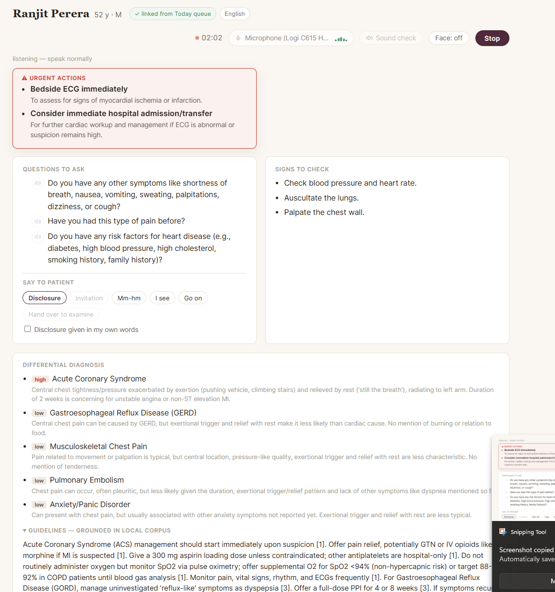
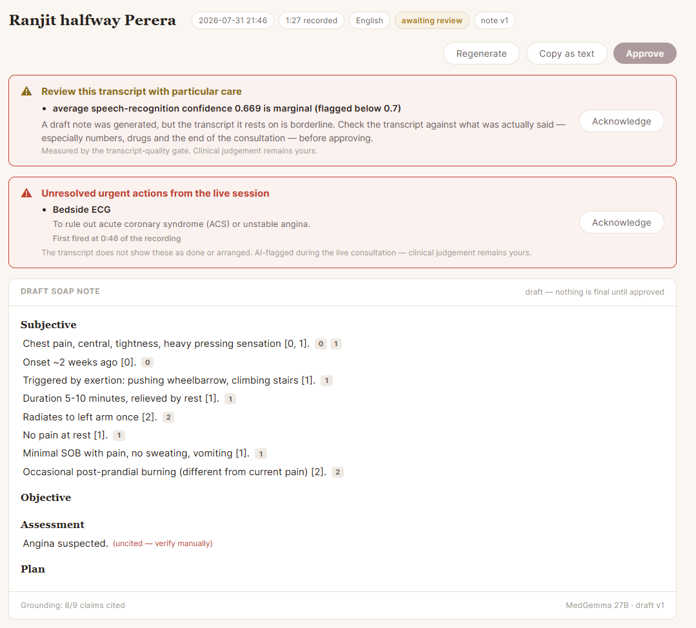
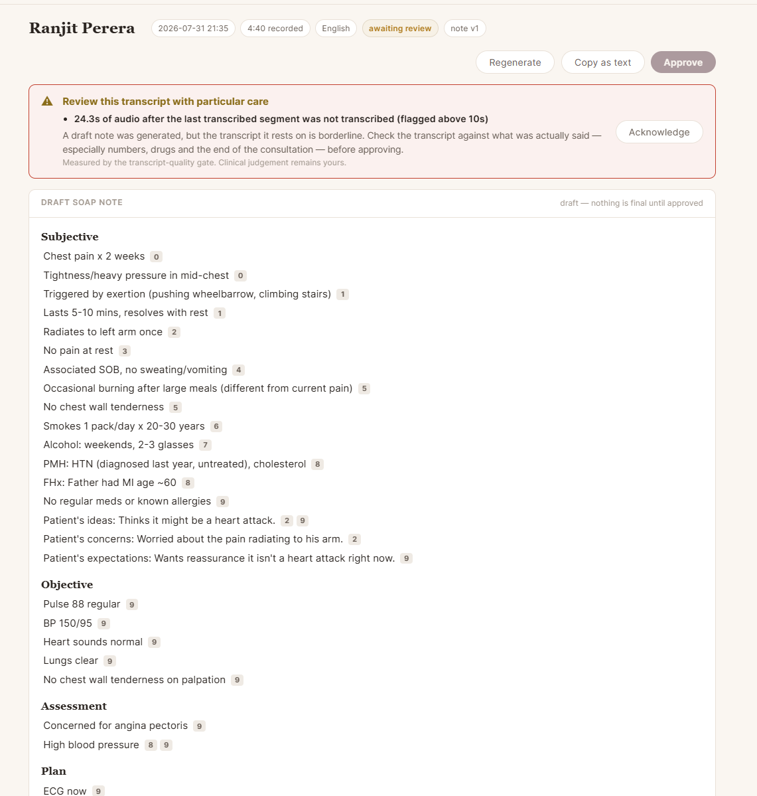
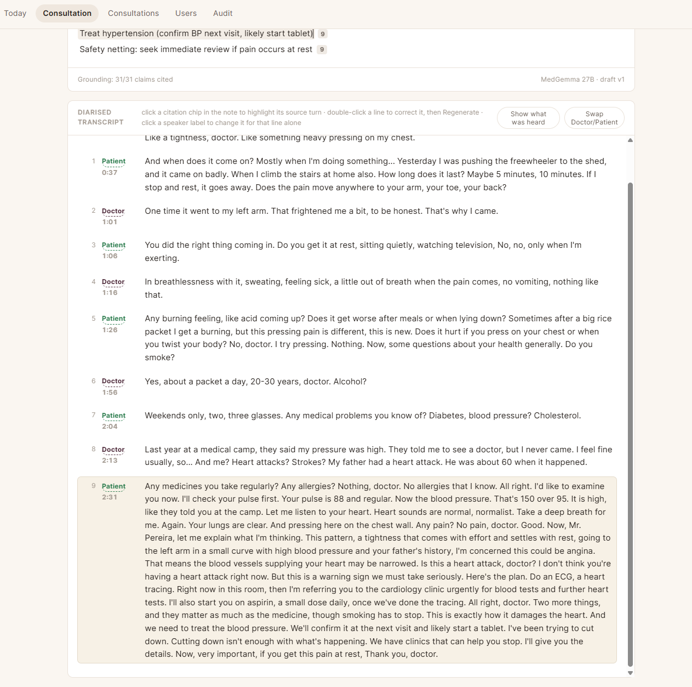
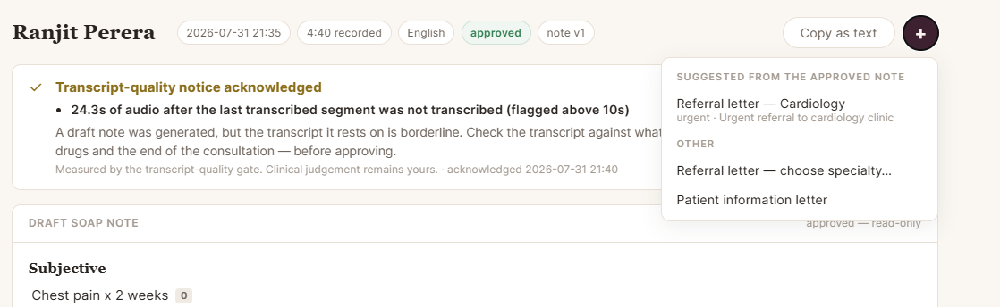
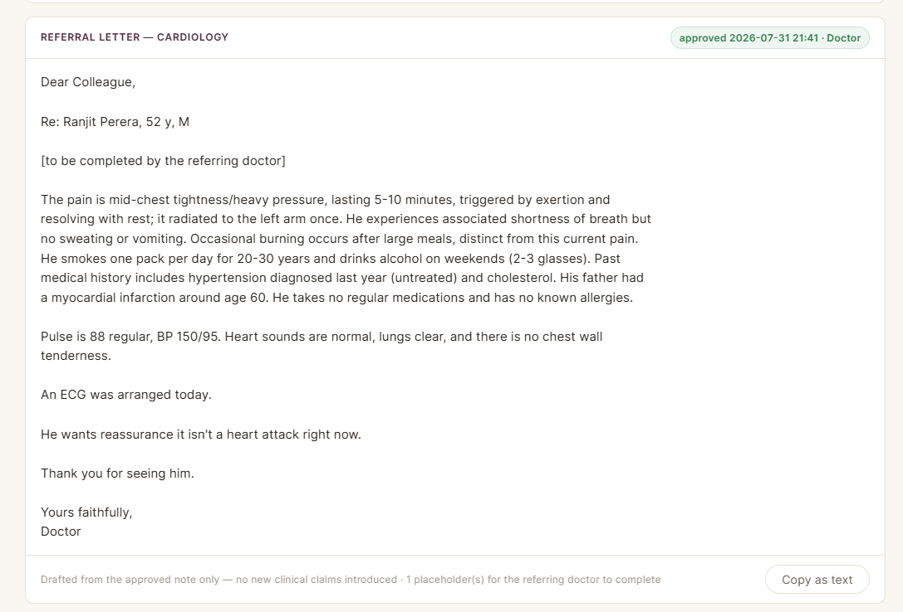

# Using it, step by step — a hand-held tour with screenshots

*Part of the Consultation AI help series. Screens shown are from a real
session with the prototype on 31 July 2026; every name and clinical detail
is synthetic — "Ranjit Perera" is an acted script, not a person. Buttons
may move as the app develops, but the flow shown here is the flow.*

This page is for the reader who wants to be shown, not told: one mock
consultation from the waiting queue to the referral letter, one screenshot
per step. It assumes someone has already installed and started the app for
you ([Installing and running it](03-installing-and-running.md) is the page
for that person) and that you can log in.

## Step 1 — Add the patient to today's queue

Open the **Today** tab. Type a name into the walk-in box, press **Start
walk-in consultation**, and the patient appears in the queue. In a
two-role practice the receptionist does this half and the doctor takes
over from here; on your own you can do both.

## Step 2 — Know the consultation screen

Starting the consultation opens the **Consultation** tab. Everything lives
on this one screen. Matching the numbers on the picture:

1. **The patient banner.** Who this consultation belongs to — filled in by
   the server from the queue, so the wrong patient cannot arrive by typo.
2. **The clock and microphone.** Recording time, and which microphone the
   app is hearing through.
3. **Face switch and Stop.** The face can be turned on or off at any time;
   Stop ends the consultation and starts the write-up. If auto mode is
   enabled on your server, an Auto switch sits here too — one tap hands the
   history-taking to the assistant, one tap takes it back — with a Hand over
   control and a status line showing what the assistant is doing.
4. **The assistant's face** — a listening presence for the patient, on
   only if you turn it on (or accept it at the disclosure).
5. **Questions to ask.** Suggestions that update as the conversation
   moves. Tap the small speaker icon and the assistant asks that question
   aloud, in its own voice — its words never enter the patient's
   transcript, by construction.
6. **Say to patient.** One-tap spoken phrases: the disclosure, small
   acknowledgements, a hand-over line for examining.
7. **Signs to check** — examination findings worth eliciting, appearing
   as the story develops.
8. **Differential diagnosis** — the working list, for your eyes. Every
   suggestion is an AI draft for the doctor, never medical advice.
9. **The live transcript**, building as you both speak.

## Step 3 — Consult; the panels work while you listen

Talk to the patient normally. The transcript streams in, questions come and
go as they are answered, and the differential revises itself as evidence
arrives. If auto mode is enabled and switched on, the assistant takes the
history instead — it invites, listens, encourages and asks aloud, one
question at a time, while you supervise and can take over with one tap. If
something time-critical appears, an **urgent actions** banner opens at the
top — in this consultation, chest pain earned a bedside ECG and, as the
story firmed up, an urgent referral. The banner is a prompt to the doctor,
not an instruction, and it clears when the transcript shows the action
arranged. With auto mode on, an alarm also pauses the assistant's
questioning: the panel asks you to acknowledge it and stays until you do —
then you resume the assistant, or take over yourself. If the same concern
fires again, it pauses again.

## Step 4 — Press Stop

When the consultation ends, press **Stop** (top right). The app asks one
question — how many people spoke — then rebuilds the transcript at higher
quality, works out who said what, and drafts the note. This takes a minute
or two; the review page opens when it is ready.

## Step 5 — Read the warnings before the note

The review page puts its warnings first, and they are worth the few
seconds. In this example the app flags that the speech recognition was
borderline, and that an urgent action from the live session was never
recorded as done. Each banner must be acknowledged before the note can be
approved — the app will not let a warning be skipped by accident.

Notice one more honesty in that picture: a claim the note could not tie to
the transcript is marked *(uncited — verify manually)* in red, and the
footer counts exactly how many claims are grounded.

## Step 6 — Check the note against the patient's own words

The draft note is a SOAP note where **every statement carries a small
numbered chip** — the transcript turn it came from. Click a chip and the
page jumps to the exact words the patient said, highlighted. This is the
heart of the design: you never have to take the note's word for anything.

Edit anything that needs editing, then press **Approve**. Nothing is final
until you do, and after approval the record becomes read-only.

## Step 7 — The letter writes itself from the approved note

Once approved, the app suggests next steps — here, a cardiology referral.
The letter is drafted **only from the approved note**, never from the raw
transcript, so nothing you rejected can resurface in it. Review it, copy
it as text, and it is ready for your usual referral route.

## What you never saw

Behind every step of this tour, an audit log recorded who viewed, edited,
acknowledged and approved what, and when — the
[security article](08-security.md) shows it. And if the recording had been
too poor to trust, the app would have refused to draft a note at all
rather than guess ([safety by construction](06-safety-by-construction.md)
explains why refusing is a feature).

---

## Where to go next

- **The same journey, explained →** [A consultation's journey](01-a-consultations-journey.md)
  — what happens under each of these steps.
- **Setting it up →** [Installing and running it](03-installing-and-running.md)
  — for whoever installs it.
- **Back to the start →** [the introduction](00-introduction.md).
