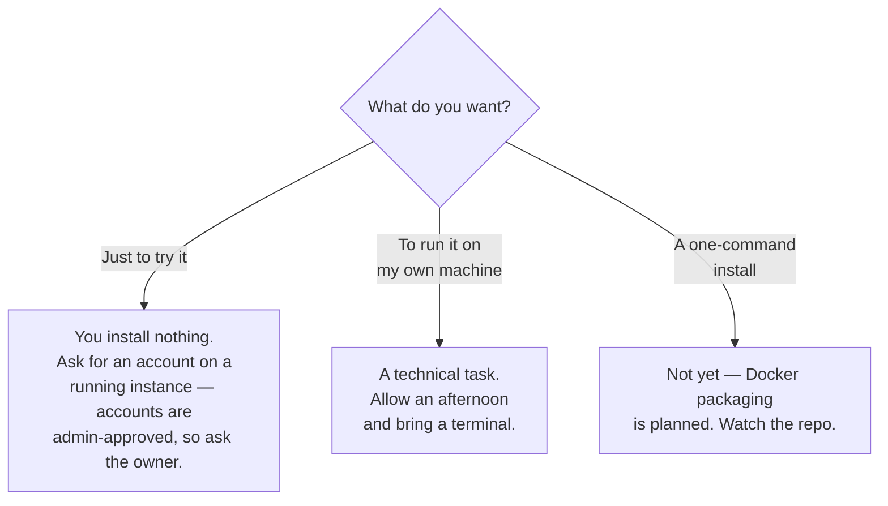

# Installing and running it — choose your path first

*Part of the Consultation AI help series. True as of 2026-07-31 (HEAD `904bb1e`).*

Be honest with yourself at the fork. This is a research platform on the
bleeding edge of local AI: the self-install path assumes you are
comfortable with a Linux command line, an NVIDIA GPU driver, and a
PostgreSQL database. There is no shame in the first path — it is how the
project's own collaborators use it.

## What the machine needs

The whole system runs locally, which means the machine pays for
everything. These are the real requirements, not aspirations:

| | Minimum that works |
|---|---|
| GPU | NVIDIA, **24 GB VRAM** (RTX 4090 class) — the reasoning model alone needs ~18 GB |
| RAM | 32 GB |
| Disk | ~60 GB free (models ~25 GB, plus database and recordings) |
| OS | Linux, or Windows 11 with WSL2 (the reference machine is WSL2) |
| Extras | A microphone and a speaker — this app talks and listens |

A smaller GPU is not "slower"; below ~24 GB the model swap choreography
breaks and finalisation fails. This is the one requirement with no
workaround.

## The seven stages, each with a checkpoint

The repository's README carries the exact commands; this is the map, so
you always know where you are and whether the last stage actually worked.

**1 · Python environment.** One command (`uv sync`) builds it — the
project pins every dependency exactly, which is why installs are
reproducible and why you should never "upgrade" anything by hand.
*Checkpoint: the test suite starts (many tests will skip — that's normal
before models and database exist).*

**2 · PostgreSQL + pgvector.** The database that holds consultations,
notes and the guideline index. *Checkpoint: `psql` connects; the pgvector
extension installs.*

**3 · Ollama + the two models.** The reasoning model (MedGemma 27B) and
the embedding model. This is the big download. *Checkpoint: `ollama ps`
runs; a trivial prompt answers.*

**4 · The audio models.** Fetched automatically on first use — but the
voice-separation model requires a free Hugging Face account and accepting
its licence terms first. Do that before your first Stop, not after.
*Checkpoint: a finalisation completes on a test recording.*

**5 · The voice.** The speech synthesiser installs as a separate tool in
its own environment — deliberately never added to the app's dependencies.
*Checkpoint: the sound check button plays "Sound check. If you can hear
this clearly, press yes."*

**6 · The guideline corpus.** Not shipped in the repository (the content
is third-party); a manifest and an ingestion script rebuild it locally,
and the script *validates* what it fetched — expect it to fail loudly if
a guideline website has moved things around. That is the script working,
not breaking. *Checkpoint: ingestion exits clean; a guideline panel
appears during a test consultation.*

**7 · Run it.** Start the server, open the browser, create the first
admin. The database tables create themselves at startup — after any
update, a restart is what applies new schema, and a check script will
tell you if the running database has drifted from the code.
*Checkpoint: log in, run one mock consultation end to end — live
transcript, Stop, note, approve.*

## Running it day to day

Set up as system services (the repo documents the reference units) so the
database, the models and the app all survive a reboot. Two habits pay for
themselves: after every code update, restart the service — the app applies
its own schema, so a restart is the upgrade; and if the web page ever
seems dead while every service claims to be healthy, check the drift
script and the troubleshooting notes before rebooting anything — the
known failure modes are documented, with fixes.

One warning learned the hard way: microphone access in a browser requires
HTTPS (or localhost). If you want to use the app from another device, you
need a proper HTTPS route to it — the reference setup uses Tailscale,
which provides certificates without exposing anything to the internet.

---

## Where to go next

- **See what you'll get →** [A consultation's journey](01-a-consultations-journey.md)
  — the whole flow, from first word to signed note.
- **Before you expose it →** [Is AI-written code safe?](08-security.md) —
  the security posture, and what a self-hoster should set first.
- **Pull a thread →** [Why one consultation at a time](05-why-one-consultation-at-a-time.md)
  — the one hardware limit with no workaround.

*Exact commands and the full troubleshooting list live in the repository's
README and [`HANDOVER.md`](../HANDOVER.md).*
