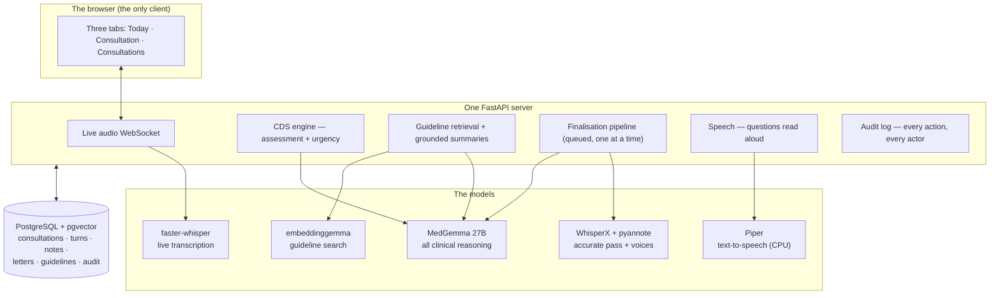
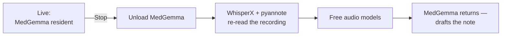

# The architecture — one machine, five models, no cloud

*Part of the Consultation AI help series. True as of 2026-07-31 (HEAD `ef6c583`).*

The whole system runs on a single desktop computer with one graphics card.
That constraint shaped every design decision, so this article is really the
story of how five AI models share one machine without treading on each
other — or on the doctor.

## The map

Three things the map can't show, and each is a deliberate choice:

## One reasoning model wears every clinical hat

MedGemma 27B does the differential, the red-flag watch, the guideline
summaries, the note and the letters — as separate calls with separate
rules, never as one conversation. All clinical output runs at temperature
zero with a fixed seed: ask the same transcript twice, get the same answer.
A system being evaluated must be repeatable, and a clinical system should
not improvise.

## The models take turns on the card

The reasoning model and the accurate-transcription models cannot fit in
24 GB together, so the finalisation pipeline choreographs them: unload the
reasoning model, run the audio models, free them, reload for the note.

This is why the note takes a minute rather than a second — and why only one
finalisation runs at a time (two would collide on the card mid-swap).

## The risky guests are kept at arm's length

Two components never enter the main process. The speech synthesiser runs as
a separate program that writes a file and exits — partly licensing hygiene,
partly so its dependencies can never destabilise the clinical stack. The
animated face is vendored at a pinned commit and driven deterministically —
no model decides its expressions, and the red-flag alarm is deliberately
not wired to it: a listening presence must not leak clinical state to the
patient.

## The spine underneath

Two quiet subsystems hold everything together. A single **schema module**
owns the database's shape — every script and test creates tables through
it, and a drift-checker can compare the live database to the code without
writing a byte. And the **audit log** records every consequential action
with who and when: approvals, corrections, voids, log-ins, even the machine
being told to speak. When this project says something happened, it can
point at the row.

---

*Model versions, exact memory figures and the dependency battle scars are
recorded in [`HANDOVER.md`](../HANDOVER.md). What these components refuse
to do — and why refusal is a feature — is the subject of* Safety by
construction.
