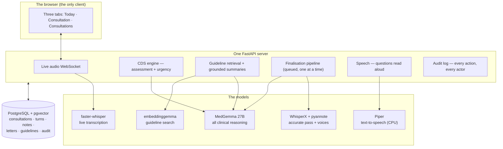
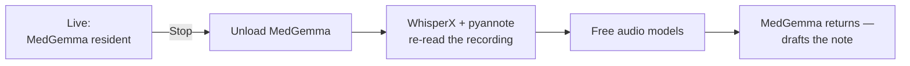
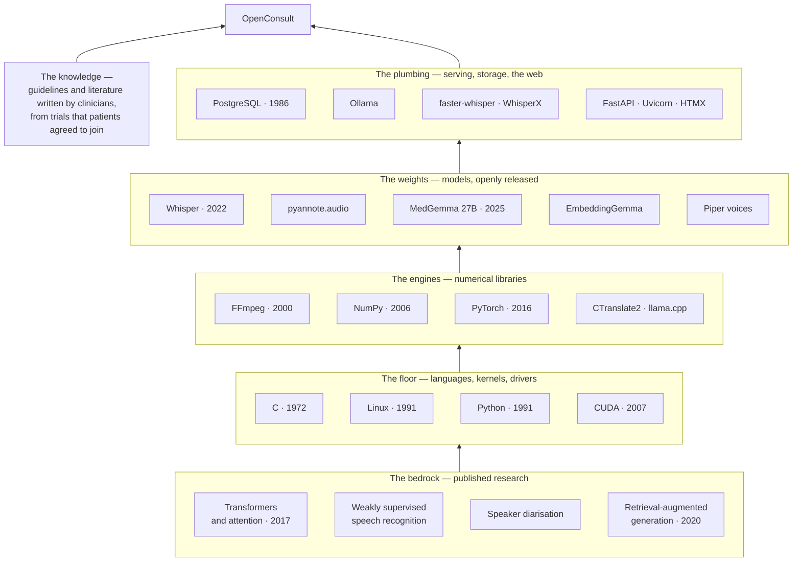

# The architecture — one machine, five models, no cloud

*Part of the OpenConsult help series. True as of v1.0.0 (2026-09-10).*

The whole system runs on a single desktop computer with one graphics card.
That constraint shaped every design decision, so this article is really the
story of how five AI models share one machine without treading on each
other — or on the doctor.

## The map

```mermaid
flowchart TB
    subgraph BROWSER["The browser (the only client)"]
        UI["Three tabs: Today · Consultation · Consultations"]
    end
    subgraph SERVER["One FastAPI server"]
        WS["Live audio WebSocket"]
        CDSE["CDS engine — assessment + urgency"]
        RAGE["Guideline retrieval + grounded summaries"]
        FIN["Finalisation pipeline (queued, one at a time)"]
        SP["Speech — questions read aloud"]
        AUD["Audit log — every action, every actor"]
    end
    subgraph MODELS["The models"]
        FW["faster-whisper\nlive transcription"]
        MG["MedGemma 27B\nall clinical reasoning"]
        EM["embeddinggemma\nguideline search"]
        WX["WhisperX + pyannote\naccurate pass + voices"]
        PI["Piper\ntext-to-speech (CPU)"]
    end
    DB[("PostgreSQL + pgvector\nconsultations · turns · notes ·\nletters · guidelines · audit")]
    UI <--> WS
    WS --> FW
    CDSE --> MG
    RAGE --> MG
    RAGE --> EM
    FIN --> WX
    FIN --> MG
    SP --> PI
    SERVER <--> DB
```

Three things the map can't show, and each is a deliberate choice:

## One reasoning model wears every clinical hat

MedGemma 27B does the differential, the red-flag watch, the guideline
summaries, the note and the letters — and, when auto mode is enabled, the
three small judgements that pace the spoken interview: has the patient
finished speaking, what a question is about and how to put it in plain
English, and which of the waiting questions to ask next. That last one only
orders the queue; it cannot remove a question. All are separate calls with
separate rules, never one conversation. All clinical output runs at
temperature zero with a fixed seed: ask the same transcript twice, get the
same answer. A system being evaluated must be repeatable, and a clinical
system should not improvise.

## The models take turns on the card

The reasoning model and the accurate-transcription models cannot fit in
24 GB together, so the finalisation pipeline choreographs them: unload the
reasoning model, run the audio models, free them, reload for the note.

```mermaid
flowchart LR
    A["Live:\nMedGemma resident"] -->|Stop| B["Unload MedGemma"]
    B --> C["WhisperX + pyannote\nre-read the recording"]
    C --> D["Free audio models"]
    D --> E["MedGemma returns —\ndrafts the note"]
```

This is why the note takes a minute rather than a second — and why only one
finalisation runs at a time (two would collide on the card mid-swap).

## The risky guests are kept at arm's length

Two components never enter the main process. The speech synthesiser runs as
a separate program that writes a file and exits — partly licensing hygiene,
partly so its dependencies can never destabilise the clinical stack. The
animated face is vendored at a pinned commit and driven deterministically —
no model decides its expressions, and the red-flag alarm is deliberately
not wired to it: a listening presence must not leak clinical state to the
patient.

## The spine underneath

Two quiet subsystems hold everything together. A single **schema module**
owns the database's shape — every script and test creates tables through
it, and a drift-checker can compare the live database to the code without
writing a byte. And the **audit log** records every consequential action
with who and when: approvals, corrections, voids, log-ins, even the machine
being told to speak. When this project says something happened, it can
point at the row.

## Dwarfs perched on the shoulders of giants

*Bernard of Chartres, as recorded by John of Salisbury, 1159*

Bernard taught at Chartres in the early 1100s. Almost nothing he wrote
survives. The line reaches us only because a student of his students wrote it
down decades after he died: we are dwarfs perched on the shoulders of giants,
and we see further than they did — not because our sight is keener, but
because their size lifts us up.

Here are the giants.

```mermaid
flowchart BT
    subgraph IDEAS["The bedrock — published research"]
        I1["Transformers\nand attention · 2017"]
        I2["Weakly supervised\nspeech recognition"]
        I3["Speaker diarisation"]
        I4["Retrieval-augmented\ngeneration · 2020"]
    end
    subgraph BASE["The floor — languages, kernels, drivers"]
        B1["C · 1972"]
        B2["Linux · 1991"]
        B3["Python · 1991"]
        B4["CUDA · 2007"]
    end
    subgraph ENGINES["The engines — numerical libraries"]
        E1["FFmpeg · 2000"]
        E2["NumPy · 2006"]
        E3["PyTorch · 2016"]
        E4["CTranslate2 · llama.cpp"]
    end
    subgraph WEIGHTS["The weights — models, openly released"]
        W1["Whisper · 2022"]
        W2["pyannote.audio"]
        W3["MedGemma 27B · 2025"]
        W4["EmbeddingGemma"]
        W5["Piper voices"]
    end
    subgraph PLUMBING["The plumbing — serving, storage, the web"]
        P1["PostgreSQL · 1986"]
        P2["Ollama"]
        P3["faster-whisper · WhisperX"]
        P4["FastAPI · Uvicorn · HTMX"]
    end
    KNOW["The knowledge —\nguidelines and literature written by clinicians,\nfrom trials that patients agreed to join"]
    TOP["OpenConsult"]
    IDEAS --> BASE
    BASE --> ENGINES
    ENGINES --> WEIGHTS
    WEIGHTS --> PLUMBING
    PLUMBING --> TOP
    KNOW --> TOP
```

Some figures behind that picture.

The C language is over fifty years old. PostgreSQL descends from a project
begun at Berkeley in 1986. Linux and Python were both released in 1991.
FFmpeg has been decoding audio since 2000, largely maintained by volunteers.

The transformer architecture that every model here depends on was set out in
one paper in 2017.

Whisper was trained on 680,000 hours of recorded speech — roughly 78 years of
continuous audio — and the weights were published rather than sold.

MedGemma has 27 billion parameters. Quantised to four bits it occupies 16 GB
and runs on a graphics card sold for playing games.

Every guideline the retrieval layer consults was written by clinicians working
from evidence that other clinicians generated, in trials that patients agreed
to join. The system knows no medicine. It finds and repeats what people who do
know wrote down.

Half a century of work, most of it given away, is what this software stands on.
OpenConsult is the small box at the top: an arrangement of these parts, and a
set of rules about what they may not do.

---

## Where to go next

- **Continue the tour →** [Why one consultation at a time](05-why-one-consultation-at-a-time.md)
  — the limit this one machine sets, and what more would take.
- **The soul of it →** [Safety by construction](06-safety-by-construction.md)
  — what these components refuse to do, and why refusal is the feature.
- **Pull a thread →** [Is AI-written code safe?](08-security.md) — how the
  same machine is defended on the network.
- **What the panel knows →** [Where the guidelines come from](09-the-guideline-corpus.md)
  — the corpus is built, validated and versioned locally, never shipped.

*Model versions and exact memory figures are in [`HANDOVER.md`](../HANDOVER.md).*
