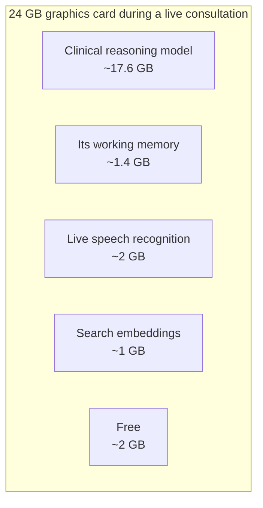
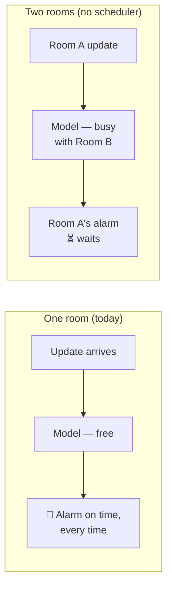

# Why one consultation at a time — and what more would take

*Part of the OpenConsult help series. True as of 2026-07-31 (HEAD `ef6c583`).*

Try to start a second consultation while one is running and the app refuses,
naming who holds the slot. That looks like a limitation. It is actually one
of the system's safety rules — and understanding why explains more about
the design than any feature does.

## The card is nearly full

Everything runs on one graphics card with 24 GB of memory. During a live
consultation, almost all of it is spoken for — these are measured figures,
not estimates:

Two consultations would need a second copy of the working memory, a second
audio stream, and — when either one presses Stop — room for the heavyweight
transcription models on top. Two gigabytes of headroom cannot hold that.

## The deeper reason: the alarm must never queue

Memory could be solved with a bigger card. The harder constraint is time.
The red-flag watchdog — the part that notices a story sounding like a heart
attack — runs on the same reasoning model as everything else. One
consultation keeps that model busy roughly a third of the time. Two
consultations would sometimes ask it two questions at once, and one of them
would wait.

A late alarm is worse than no feature at all. So the rule is enforced where
it cannot be forgotten — the server refuses the second stream — rather than
written in a guideline someone must remember. One consultation at a time is
not a throughput limit; it is a promise about the alarm.

## What simultaneous consultations would actually take

**Bigger hardware.** A 48 GB card fits everything at once and could serve
two to three rooms; an 80 GB card, five to eight. Both exist — in
workstations and by the hour in the cloud — but neither changes the promise
above by itself.

**A scheduler with proof.** With several rooms sharing one model, urgency
checks must jump every queue. That is buildable, but this project's own
standard applies: a safety property replaced by a scheduler must be
*measured* under load, not asserted. That evaluation has not been run,
which is the honest reason the feature does not exist yet.

**Or: skip the sharing entirely.** The simplest scale-out is one complete
system per consulting room — the promise ships unchanged, and "more
capacity" means another box. Hospitals have scaled by room for a century.

One more honest observation: the constraint lives almost entirely in the
*advisory* half of the system. The scribe half — transcribe, diarise, draft
a note for review — has no live alarm and no latency promise, and could
serve many rooms from one machine today. If simultaneous use ever matters,
it likely arrives there first.

---

## Where to go next

- **Continue the tour →** [Safety by construction](06-safety-by-construction.md)
  — the design philosophy that makes the single-room rule a promise, not a limit.
- **Pull a thread →** [The architecture](04-the-architecture.md) — the
  five-model machine behind the constraint, if you skipped it.

*The measured workload and hardware costings behind this article are in the
project's scaling brief; the capacity rules are in [`HANDOVER.md`](../HANDOVER.md).*
