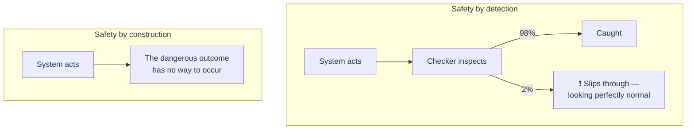
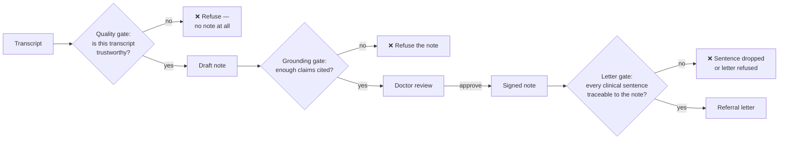

# Safety by construction — why this app refuses instead of warning

*Part of the Consultation AI help series. True as of 2026-07-31 (HEAD `536312b`).*

Most software safety works by checking: let the system act, inspect the
result, warn if something looks wrong. This project takes a different view
wherever the stakes are clinical: **make the dangerous outcome impossible
to express, and refuse rather than warn when the system cannot vouch for
its own output.** This article explains both halves, because together they
are the design philosophy everything else follows.

## Detection fails in the worst possible way

A checker that catches 98% of problems sounds good — until you ask what the
other 2% look like. In a clinical setting, a *rare* failure is worse than a
frequent one: nobody builds the habit of checking for something that almost
never happens. The most dangerous artifact this system could produce is not
a visibly broken note; it is a fluent, plausible, wrong one.

## Making it structural: the machine's voice

The clearest example: the app can speak to the patient, and its voice must
never enter the transcript. The tempting design is a filter — recognise the
machine's words and delete them. This project rejected that outright,
because a filter is detection, and echo cancellation that works 98% of the
time still fabricates patient speech 2% of the time.

Instead, the server knows *when* it was speaking (it did the speaking) and
feeds the transcriber silence for exactly those moments. The machine's
words are stored in a **separate table** from patient and doctor turns —
they have no turn number, so a note citation *cannot* point at them. Not
"is checked and rejected" — cannot. The sentence "the note cited a machine
utterance" has nowhere to happen. A real-room test confirmed it: seven
machine utterances, all in their own channel, none citable.

The same thinking runs through the speech system itself: the browser may
only *reference* a question from the on-screen list — it can never send
free text to be spoken. A request carrying its own words is rejected and
logged, not cleaned up. Sanitising would make it a filter.

## Refusing rather than warning: the gates

Where an outcome can't be made structurally impossible, the system holds
its output to a standard in code — and *withholds* it entirely when the
standard isn't met. Warnings can be read past; an absent note cannot.

Each gate exists because of a real incident. The quality gate exists
because a recording in the wrong language once produced a fluent,
entirely fabricated English note — which was approved. The grounding gate
exists because a microphone test once yielded an invented consultation,
every claim uncited. The letter gate masks the machine's differential
entirely: a referral letter presents evidence, and the specialist draws
the conclusions.

## Code decides; the model proposes

The last habit runs everywhere: whenever a behaviour must be guaranteed,
it lives in code, not in instructions to a model. The red-flag alarm is
cleared by code reading a typed answer, never by the model deciding to
tidy it away. The disclosure that tells a patient they are talking to a
computer is enforced server-side — clinical questions are refused until it
has been given, and a disabled button is never the enforcement, because a
button can be re-enabled from a browser console in ten seconds. The ⚠ flag
on risky numbers is a deterministic rule, not a model's opinion.

A prompt is a request. Code is a promise. This project reserves promises
for the things that must be true.

---

## Where to go next

- **Continue the tour →** [What the room taught us](07-what-the-room-taught-us.md)
  — how the defects were actually found, one real room at a time.
- **The web-security counterpart →** [Is AI-written code safe?](08-security.md)
  — the same "guilty until audited" habit, applied to attackers.
- **Pull a thread →** [A consultation's journey](01-a-consultations-journey.md)
  — these guarantees in the flow of a real consultation.

*Each mechanism's full account is in [`HANDOVER.md`](../HANDOVER.md).*
