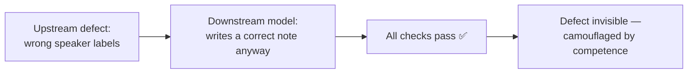

# What the room taught us — five runs, five defects no test caught

*Part of the Consultation AI help series. True as of 2026-07-31 (HEAD `f465eff`).*

This project has hundreds of automated tests, and they were green on every
day described below. It also has a rule: before a feature that touches a
patient-facing moment is called done, a human takes it into a real room —
real microphone, real speaker, real acted consultation — and uses it.

Five times in one week, the tests said yes and the room said no. This
article is the record, because the pattern matters more than any one bug:
**a test suite encodes the same assumptions as the code it tests. The room
doesn't.**

| Run | What the room found | What it taught |
|---|---|---|
| 1 | Six minutes of consultation vanished from the transcript | A safety check ate it |
| 2 | Tapping a question did nothing, silently | The offer that swallowed a tap |
| 3 | No way to stop the machine mid-sentence | The control existed — off screen |
| 4 | One voice labelled as two speakers | Hidden *because* the notes were right |
| 5 | The doctor's answer accepted, then ignored | A rule written down is not a fix |

## Run 1: the safety check that ate six minutes

A protection added days earlier — drop any transcript segment overlapping
audio the machine had muted — met a long merged turn that *contained* a few
short muted spans. "Any overlap" discarded all 204 seconds of it to remove
12.7 seconds of silence. The lesson generalises: **a defence whose failure
mode is deletion needs a proportionality rule.** The check now drops a
segment only when muted audio makes up most of it. Worth noting who blew
the whistle: the transcript-quality gate refused the wreckage — one safety
layer caught another safety layer's mistake.

## Runs 2 and 3: the interface is a safety system

In run 2, tapping a question chip did nothing — a banner elsewhere was
"offering a sound check" and consuming the tap. In run 3 the doctor wanted
to cut the machine off mid-sentence, found nothing to press, and ended the
whole consultation to silence it. The Stop control existed the entire time
— in a part of the page that had scrolled away.

Out of these came standing rules, now written into the pages themselves and
pinned by tests:

> **1. Never swallow an action.** Perform it, or visibly disable the
> control with the reason on the control itself.
> **2. A control that can act must not look as if it cannot.**
> **3. A control the doctor must reach must be where they are looking.**

Rule 3 took *two* incidents to learn, and the reason is worth keeping: the
first fix was recorded as a fact about one control ("the speaking bar is
pinned to the viewport"), so the next control made the same mistake. **A
lesson recorded as a property of one place does not generalise. A rule
does.**

## Run 4: hidden by competence

The transcript labelled one human as two speakers — and the defect had
been present in *every* previous run, unnoticed. Why? Because the
note-writing model inferred the speakers from what was said and wrote
correct notes over wrong labels. Every downstream check passed.

**A downstream component doing its job well can conceal an upstream defect.**
That is not a mercy; it is camouflage. The fix followed another pattern the
project keeps meeting: measurement proved unreliable (the voice-counting
model errs in both directions), so the human in the room now *declares* how
many people spoke, and the measurement corroborates. Ask the human;
instrument the answer.

## Run 5: writing the rule down did not prevent the fourth instance

Every hard rule held in run 5 — the machine could be silenced instantly,
the transcript guarantee proved intact end to end. And still: the doctor
answered the new speaker-count question, and the pipeline silently ignored
the answer, which had arrived eleven seconds too late. It was the *fourth*
control in one week to accept an action and explain itself somewhere nobody
looked — the fourth instance occurring in a feature built to fix the third.

The response was not a fifth reminder. It was a test that fails if an
answer can be accepted and discarded without a trace, and a pipeline that
now waits for the answer instead of hoping to be faster than it. **Written
lessons do not prevent recurrence. Structure and tests do.**

## Why the evidence is kept

The consultations behind these runs are preserved unrepaired — protected
from deletion, never re-processed. They are the project's regression
fixtures and its proof: the run that lost six minutes, the run where the
guarantee held, the first consultation ever approved after a hand-corrected
speaker label. When this project says its guarantee survives a real room,
it points at a database row, not a recollection.

---

*Full forensics of every run — with the measured numbers — are in
[`HANDOVER.md`](../HANDOVER.md). The design philosophy the room kept
vindicating is* Safety by construction.
