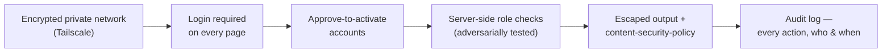

# Is AI-written code safe? — how this app was hardened, and audited by an adversary

*Part of the Consultation AI help series. True as of the security-hardening
commit it ships with — see the repository history.*

There is a fair criticism of software written with heavy AI help: models
produce code that *looks* right, and looking right is exactly how a
security hole hides. A plausible login form can forget to check a password
properly; a tidy database query can leave a door open; the human reviewing
it often didn't write it and can't see the gap. If that worry brought you
to this page, good — it is the right worry, and this project treated it as
a first-class risk rather than waving it away.

Here is what that meant in practice.

## The app is small on purpose, and private by default

Every risk starts with exposure, so the design minimises it. The whole
system runs on **one machine, with no cloud** — there is no server farm to
misconfigure, no third-party service holding a copy of anything. It is
reachable from elsewhere only over **Tailscale**, an encrypted private
network, not through open ports on the public internet. Behind that,
**every page requires a login** (with one exception: a status endpoint that
returns only anonymous counts — no names, no clinical text, by
construction). New accounts are **inactive until an administrator approves
them**. And it has only ever handled synthetic consultations — there is no
real patient data to lose.

## Security by construction, again

The same instinct that shapes the clinical safety — *make the bad outcome
impossible, don't just watch for it* — runs through the plumbing:

- Database queries never paste user text into the query; values are always
  passed as bound parameters, which closes the classic injection route by
  construction.
- The component that speaks aloud runs as a separate program with no shell,
  so nothing a user types can become a command.
- There is no way to ask the server for a recording by guessing a filename;
  file paths are built server-side from typed numbers, so there is nothing
  to traverse.
- Who-can-see-what is checked on the server for *every* request — reads as
  well as writes — and those checks are tested adversarially: a
  receptionist deliberately trying to open a doctor's page gets refused, and
  a test proves it stays that way.
- Sessions are signed and compared in constant time; deactivating an
  account genuinely ends its live sessions. Every consequential action —
  approvals, edits, the machine being told to speak — lands in an audit log
  that records who and when.

## We hired an adversary — and it found something

None of that is worth much as a claim. So before going public, the project
ran an **independent security audit**: a structured review against a
written threat model — an attacker on the open internet, and a hostile user
who got an account — across a dozen areas, backed by standard scanners, with
a rule that every automated hit was confirmed by reading the actual code
before it counted.

Most of it held. The audit's own "checked and clean" list is longer than
its findings: the injection routes, the access controls, the session
handling, the file paths, the status endpoint — all tried, all sound.

But it found a real one, and this page would be worthless if it hid it. The
front end built parts of its pages by pasting stored text straight into the
document — so a name typed during registration could carry a hidden script
that would run in an administrator's browser. It was fixable at the root,
because the cause was single: text was being trusted where it should have
been escaped. Every place that did this now escapes its output — that is
the fix — and tests fail if the pattern ever returns. A browser-level
**content-security policy** adds further hardening around it; its strictest
form, refusing inline scripts outright, is a scheduled follow-up once the
pages are restructured to allow it.

That is the whole point, and the honest answer to the question in the
title. AI-written code is not automatically safe — and neither is
human-written code. What makes code trustworthy is not who typed it but
whether it was **treated as guilty until audited**: a written threat model,
an adversarial review, the findings published rather than buried, and the
fix pinned by a test. The audit spec and this project's failure log are in
the repository for exactly that reason. Read them, and disagree in the
open — that is the only kind of security claim worth making.

---

## Where to go next

- **The clinical-safety counterpart →** [Safety by construction](06-safety-by-construction.md)
  — the same "make it impossible" instinct, applied to patient safety.
- **Pull a thread →** [What the room taught us](07-what-the-room-taught-us.md)
  — defects found by real use, published rather than buried.
- **Back to the start →** [the introduction](00-introduction.md) — the whole
  tour, and the router by reader type.

*The engineering detail lives in [`HANDOVER.md`](../HANDOVER.md).*
