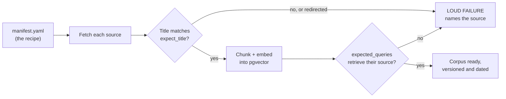

# Where the guidelines come from — a corpus you build, not download

*Part of the OpenConsult help series. The example manifest in the
repository shows the format; the corpus your instance holds is defined
by your own local manifest.*

The guidelines panel does something deliberately narrow: it summarises
only from real guideline text it has retrieved, cites every claim, and
declines when the corpus doesn't cover a topic. This page answers the
question that design raises: where does that guideline text come from,
and why isn't it in the repository?

## Why the repository ships a format, not the documents

Two reasons, and both would be enough alone.

**Licence.** Clinical guidelines are third-party copyrighted content,
and publishers' terms differ — on copying, on redistribution, and on
use with AI systems. Those licences are yours to hold, not ours to
assume: the repository ships no guideline content and names no
publisher, and each installation ingests only sources its operator has
the right to use that way. So the documents are never committed, and an
image or archive containing them would be redistribution too.

**Staleness.** Guidance changes, and serving last year's guidance is
itself a clinical risk. During one corpus expansion, two guidelines
were found to have been replaced entirely — and the retired pages
didn't disappear; they silently redirected to overview stubs. A bundled
corpus would have carried the dead versions without anyone noticing. A
corpus each installation fetches for itself, dated and versioned,
cannot quietly rot in the repository.

What IS committed is `corpus/manifest.example.yaml`: a working example
of the recipe and the receipt. Your instance's real recipe is your own
`corpus/manifest.yaml`, which stays local — like `.env`, it describes
your installation, not the project. For every source it records the
publisher, the exact URL, a licence note, the ingestion date — and two
validation fields described below. The corpus becomes a property of an
installation, declared rather than bundled: your instance knows exactly
what it holds and when it was fetched.

## Building yours: one command

Copy the example manifest to `corpus/manifest.yaml`, edit it to list
sources you hold licences for, then — with the embedding model pulled
(`ollama pull embeddinggemma`, one-time):

    uv run python scripts/ingest_guidelines.py

The script walks the manifest: fetches each source, chunks it along the
document's own structure, embeds the chunks, and stores them in
PostgreSQL. Then it validates what it fetched — and this is the part
worth understanding, because a failure here is the script protecting
you, not breaking.

Two gates, each earned by a real incident:

- **`expect_title`** — a substring that must appear in every fetched
  page's title. This catches replaced guidelines and wrong codes at
  fetch time, and a redirect to a different page counts as a failure,
  because that is exactly how retired guideline pages tend to fail:
  they redirect instead of returning an error.
- **`expected_queries`** — two or three realistic retrieval queries per
  source. After ingestion, each must actually retrieve a chunk from its
  own source at a similarity above the refusal floor. A document that
  downloads but cannot be found again has not really been ingested —
  chunk counts alone prove nothing about retrievability.

A source that fails either gate fails the run loudly, by name, and a
partially ingested corpus never presents itself as ready. If a guideline
website has moved things around, expect the script to say so — that is
the design working.

If your instance has no manifest at all, the app still runs: the
guidelines panel simply reports that no corpus is configured and
declines every query, the same honest refusal it gives for a topic the
corpus doesn't cover.

## Making it your own

This is where the corpus stops being plumbing and becomes a research
instrument. The manifest defines what your instance will and will not
discuss: ask the panel about something outside it and you get a polite
refusal, not an improvisation. Which means an investigator can shape the
system's knowledge deliberately — a different specialty, a different
country's guidance, a deliberately restricted set for a study condition.

To add a source: give it a slug, title, publisher, URL, an
`expect_title` substring, two or three `expected_queries`, and a licence
note recording your basis for using it, then re-run the ingestion
command. Then one standing rule, learned the evaluation-first way:
**after any corpus change, re-run the retrieval-composition harness**
(`scripts/evaluate_retrieval_composition.py`) so the retrieval behaviour
is measured again rather than assumed. The harness writes a dated
results file beside the baseline, so the comparison is explicit.

One honest limit: not everything can be ingested. Some publishers block
automated fetching entirely, and some pages need a substitute source
covering the same ground. The manifest records that kind of
substitution rather than hiding it.

---

## Where to go next

- **The install map →** [Installing and running it](03-installing-and-running.md)
  — the corpus is stage 6 of seven.
- **Where retrieval sits →** [The architecture](04-the-architecture.md)
  — how the guidelines panel relates to the rest.
- **Back to the start →** [the introduction](00-introduction.md) — the
  whole tour, and the router by reader type.

*The example manifest, with two working sources and their validation
queries, is [`corpus/manifest.example.yaml`](../corpus/manifest.example.yaml)
in the repository.*
